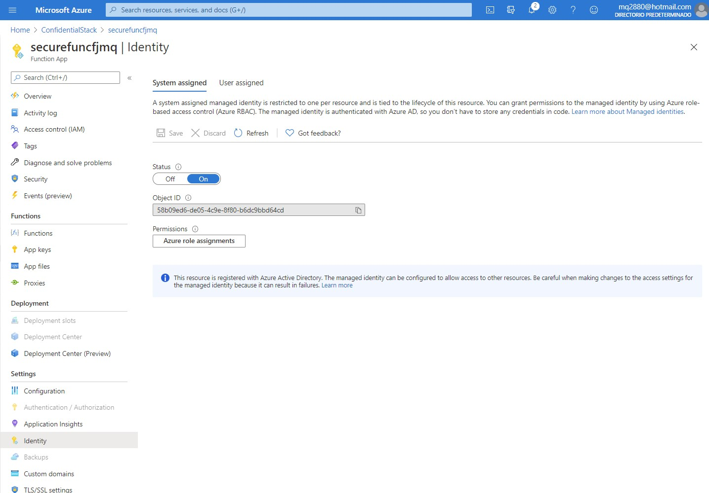

# Module 7 Implement secure cloud solutions

## Lab: Access resource secrets more securely across services | Student lab manual

1. **Nombres y apellidos:** Francisco Javier Moreno Quevedo
2. **Fecha:** 17/01/2021
3. **Resumen del Ejercicio:** Permitir que una aplicacion pueda acceder a los secretos almacenados en un Key Vault
4. **Dificultad o problemas presentados y como se resolvieron:** Ninguna

### Exercise 1: Create Azure resources

1. Crear una cuenta de almacenamiento

   

1. Crear una nueva **key vault**

   

1. Crear una nueva **function app**

   

### Exercise 2: Configure secrets and identities

1. Crear un nuevo Secreto en el Vault

   

   

1. Crear una nueva access policy 

   

1. Crear una nueva **application setting**

   


Crear un nuevo proyecto del tipo **Azure Functions Core Tools** 

```powershell
func init --worker-runtime dotnet
```

Compilar

```powershell
dotnet build
```

Crear una nueva Funcion **FileParser**

```powershell
func new --template "HTTP trigger" --name "FileParser"
```

Actualizar las siguientes entradas del **local.settings.json** 

```json
   "Values": {
       "AzureWebJobsStorage": "UseDevelopmentStorage=true",
       "FUNCTIONS_WORKER_RUNTIME": "dotnet",
       "StorageConnectionString": "[TEST VALUE]"
   }
```

En **FileParser.cs** borrar todo y añadir

```csharp
using Microsoft.AspNetCore.Mvc;
using Microsoft.Azure.WebJobs;
using Microsoft.AspNetCore.Http;
using System;
using System.Threading.Tasks;

public static class FileParser
{ 
    public static async Task<IActionResult> Run(
        HttpRequest request)
    {
        [FunctionName("FileParser")]
		public static async Task<IActionResult> Run(
        [HttpTrigger("GET")] HttpRequest request)
	    { 
            string connectionString = Environment.GetEnvironmentVariable("StorageConnectionString");
            return new OkObjectResult(connectionString);
		}
    }

}
```


Ejecutar

```powershell
func start --build
```

```powershell
httprepl http://localhost:7071
```


Nos cambiamos a **api/fileparser** 

```powershell
cd api
cd fileparser
get
```

Debemos obtener [TEST VALUE]


Publicamos la funcion

```powershell
az login
```

```powershell
func azure functionapp publish <function-app-name>
```


Vamos a la funcion en Azure y la probamos


### Exercise 4: Access Azure Blob Storage data

Subimos el fichero **records.json** al blob


Añadimos el paquete Azure.Storage.Blobs al proyecto 

```powershell
dotnet add package Azure.Storage.Blobs --version 12.6.0
```


En el **FileParser.cs** añadir


```csharp
using Azure.Storage.Blobs;
```

Borramos

```csharp
return new OkObjectResult(connectionString);
```

añadimos

```csharp
BlobClient blob = new BlobClient(connectionString, "drop", "records.json");
```

```csharp
var response = await blob.DownloadAsync();
```

```csharp
return new FileStreamResult(response?.Value?.Content, response?.Value?.ContentType);
```

Publicamos y probamos desde azure

```powershell
func azure functionapp publish <function-app-name>
```


